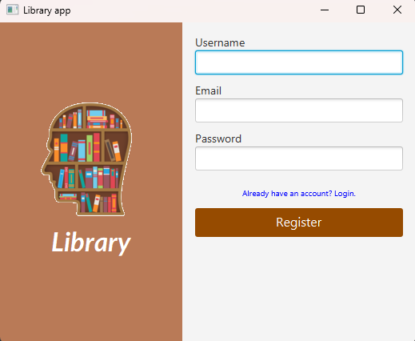
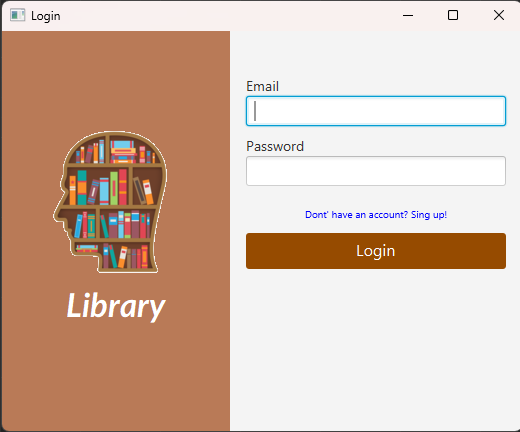
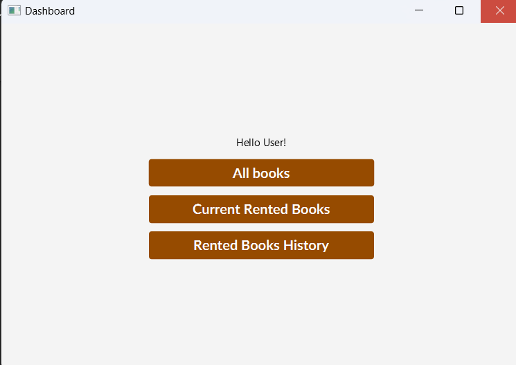

# Projekt czytelnia

### Autorzy

Marcin Bereta, Hubert Gancarczyk, Magdalena Skrok, Laura Wiktor

# Opis

Projekt zakłada stworzenie aplikacji obsługującej działalność czytelni, oferującej trzy poziomy dostępu: użytkownika, pracownika i administratora.

Użytkownik ma możliwość rejestracji w systemie, podając swój adres email, nick oraz ustawiając hasło zgodne z regułami. Dzięki temu będzie mógł zalogować się do systemu, wyświetlić polecane książki, ocenić te które chociaż raz czytał, wyświetlić statystyki, sprawdzić spis treści i okładkę wybranej pozycji, dodatkowo będzie mógł wyświetlić książki danego autora.

Funkcje pracownika obejmują przyjmowanie zwracanych książek oraz udzielanie kolejnych wypożyczeń czytelnikom. Natomiast uprawnienia administratora pozwalają na dodawanie nowych książek do bazy danych. Oboje mają możliwość podglądu aktualnego stanu czytelni.

Cała aplikacja jest oparta na języku Java oraz wykorzystuje framework Spring Boot. Struktura projektu została logicznie podzielona na frontend i backend. Backend odpowiada za połączenie z bazą danych oraz obsługę systemu, natomiast frontend zajmuje się warstwą wizualną, zapewniając interakcję użytkownika z aplikacją.

Aby uruchomić projekt należy uruchomić LibraryApp.

# Schemat bazy danych

Baza danych zawiera pięć tabel obsługujących funkcjonalność aplikacji. Tabela member przechowuje informacje o pracowniku, administratorze lub czytelniku. Tabela Book odpowiada za dane dotyczące pojedynczego egzemplarza książek będących na stanie czytelni. Reading_room przechowuje dane o korzystających z czytelni, a Rate pozwala na ocenę danej książki przez czytelnika. Tabela Author przechowuje informacje o autorach dostępnych pozycji.

# Aktualny - niekompletny schemat aplikacji z zależnościami Spring'a

# Aktualny - niekompletny schemat obiektowy aplikacji

# Zakładany końcowy model obiektowy

## Widoki

**Widok użytkownika** - będzie udostępniał najlepsze statystyki, możliwość oceny czytanych książek oraz ich listę. Z widoku użytkownika będzie możliwość przejścia do widoku książek. \
**Widok pracownika** - będzie umożliwiał rozpoczęcie wizyty czytelnika jak i jej zakończenie, ponadto będzie dostarczał możliwość aktualnego podglądu czytelni - użytkowników i posiadanych przez nich książek. \
**Widok administratora** - będzie umożliwiał dodanie nowej książki do czytelni oraz będą dostępne wszystkie funkcje administratora oraz usunięcie użytkownika. \
**Widok książek** - pozwoli przeglądać dostępne pozycje, wyświetlenia wszystkich książek podanego autora lub wybranej kategorii. \
**Widok książki** - pozwoli wyświetlić konkretną pozycję, jej autora, udostępni możliwość sprawdzenia okładki i spisu treści wybranej książki.

### Już zaimplementowane:

**BaseController** - abstrakcyjna klasa kontrolera interfejsu użytkownika. Zawiera metody obsługujące nawigację między scenami oraz obsługę logowania.\
**Metody:**\
void redirectToScene(String scenePath, String title, Stage stage)\
void handleSuccessfulLogin(Member member)\
Node getStage()\
void initialize(URL url, ResourceBundle resourceBundle)

**LoginController** - kontroler obsługujący widok logowania dostępny po uruchomieniu aplikacji i przejściu przez odnośnik dotyczący posiadania już konta. W przypadku poprawnych danych loguje użytkownika i przenosi go do nowego widoku, w przeciwnym przypadku wyświetla stosowny komunikat.\
**Metody:**\
void onKeyPressed()\
void redirectToSignUp()\
void onLoginClick()\
void hideErrorMessage()\
void showErrorMessage(String message)\
void handleSuccessfulLogin(Member loggedInUser)\
Node getStage()

**RegisterController** - kontroler obsługujący widok rejestracji dostępny po uruchomieniu aplikacji. W przypadku poprawnych danych rejestruje nowego użytkownika i przenosi go do nowego widoku, w przeciwnym przypadku wyświetla stosowny komunikat. Posiada też opcję przejącia do widoku logowania dla zarejestrowanych użytkowników. \
**Metody:**\
void onKeyPressed()\
void redirectToLogin()\
void onRegisterClick()\
void hideErrorMessage()\
void showErrorMessage(String message)\
void handleSuccessfulLogin(Member loggedInUser)\
Node getStage()

**DashboardController** - klasa dziedzicząca po BaseController służąca do obsługi podstawowego widoku po zalogowaniu użytkownika - prototyp widoku użytkownika. Pobiera i wyświetla ostationo zalogowanych użytkowników.\
**Metody:**\
void initialize(URL url, ResourceBundle resourceBundle)\
void displayUsername()\
Node getStage()

## Serwisy

**StatisticsService** - obsłuży logikę biznesową statystyk - dodanie opinii i najlepsze opinie bez lub wraz z opisem, będzie posiadał metody:
_getBestBooks_, _getBestOpinions_, _addRate_. \
**BookService** - obsłuży logikę biznesową książek - książki danego autora, danej kategorii lub o danym tytule oraz dodanie nowej książki, będzie posiadał metody:
_getBooksByAuthor_, _getBooksByAuthorNick_, _getBooksByCategory_, _getBookByTitle_, _addBook_. \
**ReadingRoomService** - obsłuży logikę biznesową czytelni - początek i koniec wizyty oraz aktualnie trwające wizyty jak i aktualną wizytę konkretnego użytkownika, będzie posiadał metody:
_addVisit_, _getActualVisits_, _setEnd_, _getActualVisitByName_.

### Już zaimplementowane:

**MemberService** - obsłuży logikę biznesową związaną z obsługą czytelnika - logowanie, rejestracja oraz pobranie listy najnowszych członków. \
**Konstruktor:** MemberService(MemberRepository memberRepository) \
**Metody:**\
ReturnModel register(String username, String password, String email)\
ReturnModel login(String email, String password)\
List\<Member> getLatestMembers(int memberCount)

## Persystencje

**StatisticsRepository** - rozszerzy interfejs JpaRepository o: _getBestBooks_ (pobierze z bazy najlepsze książki porównując punkty), _getBestOpinions_ (pobierze najlepsze książki wraz z ich opisowymi opiniami). \
**BookRepository** - rozszerzy interfejs JpaRepository o: _findByAuthor_ (pobierze z bazy książki podanego autora), _findByTitle_ (pobierze z bazy książke o danym tytule). \
**ReadingRoomRepository** - rozszerzy interfejs JpaRepository o: _getActualVisitByName_ (zwróci z bazy dane aktualnie trwającej wizyty danego czytelnika), _findActualVisits_ (zwróci z bazy wszystkie aktualnie trwające wizyty).

### Już zaimplementowane:

**MemberRepository** - rozszerza domyślny interfejs JpaRepository o metodę _findByEmail_ zwracającą obiekt Member na podstawie podanego adresu email, o ile istnieje.

## Modele

**ReadingRoom** - reprezentujący konkretną wizytę w czytelni - tabelę ReadingRoom z bazy, poza podstawowymi metodami będzie posiadał metodę _checkDate_, która sprawdzi czy początek wizyty poprzedza jej koniec.\
**Statistics** - reprezentujący konkretną opinię - tabelę Rate z bazy, poza podstawowymi metodami będzie posiadał metodę _checkRate_, która sprawdzi czy wartość wystawionej opinii znajduje się w przedziale 0-5.

### Już zaimplementowane:

**Member** - reprezentujący członka czytelni - tabelę Member z bazy, poza podstawowymi metodami posiada metody _verifyEmail_ i _verifyPassword_, które sprawdzają poprawność danych wejściowych. \
**Konstruktor:** Member(String name, String email, String password)

**Book** - reprezentujący książkę - tabelę Book z bazy, posiada podstawowe metody. \
**Konstruktor:** Book(String title, String author, String description, String bookCover)

## Pozostałe zaimplementowane klasy potrzebne do działania aplikacji:

### MemberConfigurator

Jest to klasa konfiguracyjna, która w przypadku braku jakiegokolwiek członka biblioteki doda do niej przykładowego użytkownika.

### Permissions

Enum zawierający dostępne funkcje w aplikacji – admin, pracownik, członek biblioteki.

### ReturnModel

Klasa reprezentuje model zwracany przez aplikację, zawiera on obiekt, wiadomość i kod z nim związany. \
**Konstruktor:** ReturnModel(ReturnObject object, String message, int code)

### ReturnObject

Interfejs posiadający jedną metodę _toJson_ konwertującą obiekty implementuje ten interfejs do formatu JSON.

### SpringContext

Singleton przechowujący kontest aplikacji Spring. \
**Konstruktor:** SpringContext() \
**Metody:** \
SpringContext getInstance() \
ConfigurableApplicationContext getContext() \
void setContext(ConfigurableApplicationContext context)

### UserState

Singleton przechowujący informacje o zalogowanym użytkowniku. \
**Konstruktor:** UserState() \
**Metody:** \
UserState getInstance() \
Member getLoggedInUser() \
void setLoggedInUser(Member loggedInUser)

### Validator

Klasa obsługuje sprawdzanie poprawności podawanych przez użytkownika danych. \
**Konstruktor:** Service() \
**Metody:** \
 boolean validateEmail(String email)\
 boolean validateUsername(String username)\
 boolean validatePassword(String password)

### LibraryApp

Klasa obsługuje frontend aplikacji - interfejs użytkownika. \
 **Metody:** \
void start(Stage primaryStage) \
void configureStage(Stage primaryStage) \
void init()\
void main(String[] args)

# Aktualny wygląd aplikacji

### Widok rejestracji

### Widok logowania

### Widok po zalogowaniu

